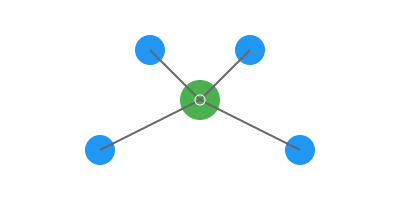
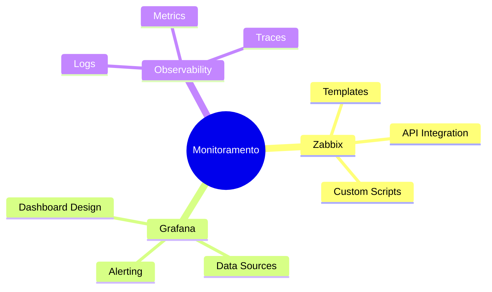

<h1 align="center">
  Olá! 👋 Bem-vindo ao meu Universo de Monitoramento
</h1>

<p align="center">
  
</p>

<p align="center">
  
</p>

## 🎯 Sobre Mim

Sou um entusiasta e profissional focado em soluções de monitoramento e observabilidade. Minha paixão está em construir e otimizar sistemas de monitoramento que proporcionam visibilidade completa da infraestrutura de TI.

```ascii
🔍 Principais Tecnologias:
┌──────────────────────────────────────┐
│  ⭐ Zabbix    ⭐ Grafana             │
│  ⭐ Prometheus ⭐ Alertmanager       │
│  ⭐ ELK Stack  ⭐ Network Monitoring │
└──────────────────────────────────────┘
```

## 💡 Expertise

- 📊 Implementação e gestão de soluções Zabbix
- 📈 Desenvolvimento de dashboards Grafana
- 🔄 Automação de monitoramento
- 🎯 Monitoramento proativo
- 🛠 Integração de ferramentas de observabilidade
- 🚀 Otimização de performance

## 📚 Estudos Atuais



## 🌐 Redes e Contatos

<p align="center">
  <a href="https://linkedin.com/in/micaele-oliveira-da-silva">
    
  </a>
  <a href="mailto:micaeleoliveira7878@gmail.com">
    
  </a>
  <a href="https://github.com/MicaeleOliveira">
    
  </a>
</p>

## 📊 Estatísticas GitHub

<p align="center">
  
</p>

## 🎯 Projetos em Destaque

### 🔍 Zabbix Templates Collection
Coleção de templates personalizados para diferentes cenários de monitoramento.

### 📊 Grafana Dashboards
Dashboards otimizados para visualização de métricas críticas.

### 🚀 Automation Scripts
Scripts para automatização de tarefas de monitoramento.

## 💻 Tecnologias & Ferramentas

<p align="center">
  
  
  
</p>

---


